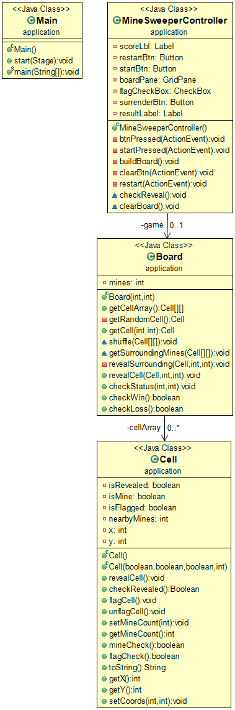

# MineSweeper By Team1

## Team Members

|Member|Role|
|------|----|
|Christian Coplen|Documentation & Cell Class|
|Austin Walker|Tester & GUI|
|Ashton Smith|Architect & Board|

## Classes

### Cell

The cell class is used to create new cells which are then stored in the board's ArrayList to be used in the game. This class includes methods for checking if a cell is a mine, is flagged, or has been revealed which then determines how it is represented in the board and a method to show the count of nearby mines, as well as other methods used to set the status of the cell used in the board. Stores the variables for use in the logic of how the board is displayed as well as what happens.

### Board

The board class is used to create a list to store Cells in and plays a large part in the making of our game. This class includes some complex methods for generating the board itself and storing cells inside of it and randomizing the placement of the mines as well as methods for revealing the spaces on the board recursively if a blank cell has been clicked. This class also contains the methods to check if a game has been won or lost. Acts as a communicator between the Cell class and the GUI, storing all of the individual cells as well as where they are located on the board and telling the GUI the status of the given Cell when clicked.

### GUI

The GUI was made in Java FXML, it is the visual representation of the board class. Everything that happens visually is stored in a Board object. It is controlled in our MineSweeperController class, which contains methods to interact with the board and get the information necessary to work. It passes in the clicked cell and depending on the information it recieves, different things can happen and displays that visually. It contains all the game logic to make MineSweeper function as everyone knows it to. 

## Bugs and Unresolved Issues

At this point in time, there are no known bugs in our game. If one is found we will move swiftly to get rid of it! 

At some point we would like to figure out how to differentiate between a left and right click so we don't have to have a checkbox clicked to flag a cell. This is something we would like to maybe get done by the end of the second phase.

## UML Diagram

